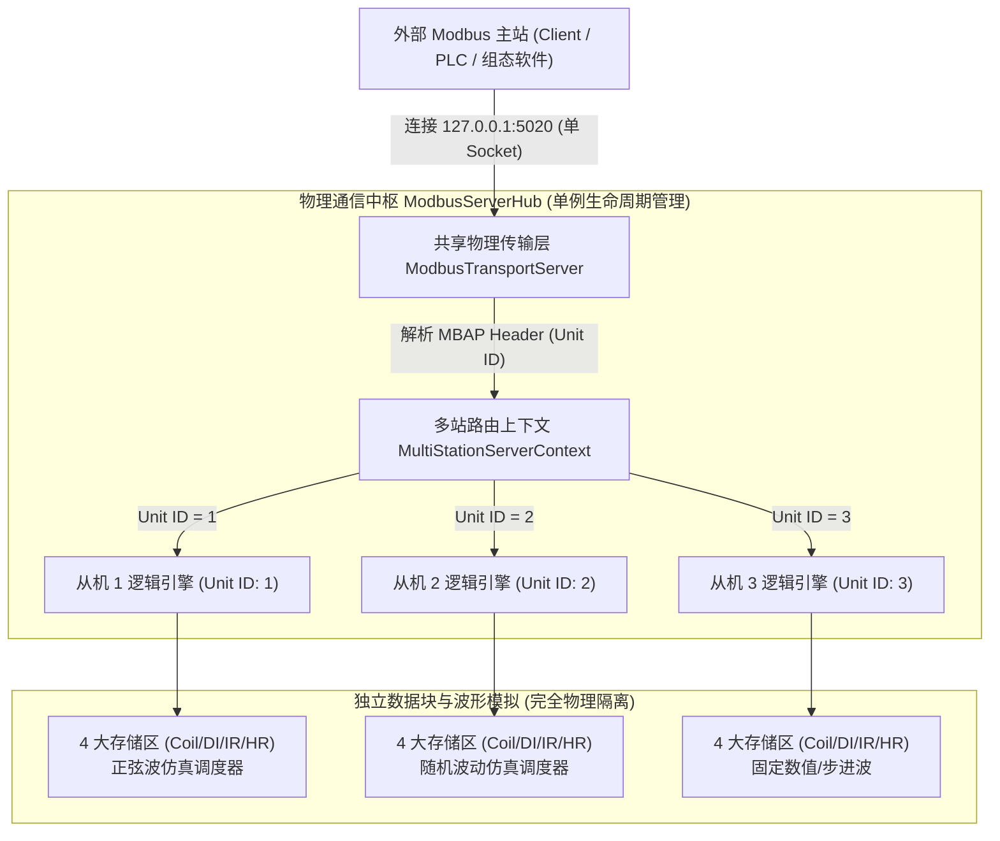

# Modbus Studio - 多站地址同端口并发架构与技术规范文档
> **版本**：v2.1  
> **适用模块**：Slave 从机服务、底层通信引擎、多站路由上下文、数据库导入中心  
> **适用场景**：第三方 AI 审查（AI Code Review）、工业级 Modbus 协议合规性审计、架构设计存档  

---

## 目录
- [一、 业务背景与历史架构痛点](#一-业务背景与历史架构痛点)
- [二、 遵循的 Modbus 官方协议标准](#二-遵循的-modbus-官方协议标准)
- [三、 整体架构重构设计 (Server Hub 模式)](#三-整体架构重构设计-server-hub-模式)
  - [3.1 架构分层拓扑图](#31-架构分层拓扑图)
  - [3.2 核心解耦设计原则](#32-核心解耦设计原则)
- [四、 核心模块与实现细节](#四-核心模块与实现细节)
  - [4.1 物理端点唯一键 (EndpointKey)](#41-物理端点唯一键-endpointkey)
  - [4.2 多站动态路由上下文 (MultiStationServerContext)](#42-多站动态路由上下文-multistationservercontext)
  - [4.3 单例物理传输中枢 (ModbusServerHub & ModbusTransportServer)](#43-单例物理传输中枢-modbusserverhub--modbustransportserver)
  - [4.4 逻辑从机与波形仿真解耦 (ModbusSlaveEngine)](#44-逻辑从机与波形仿真解耦-modbusslaveengine)
  - [4.5 业务服务层真实冲突判定 (SlaveService)](#45-业务服务层真实冲突判定-slaveservice)
  - [4.6 数据库设备真实站地址提取 (HemsAppModel & DbImportDialog)](#46-数据库设备真实站地址提取-hemsappmodel--dbimportdialog)
- [五、 自动化测试验证与验收基准](#五-自动化测试验证与验收基准)
- [六、 供第三方 AI Review 工具审查的重点核验清单](#六-供第三方-ai-review-工具审查的重点核验清单)

---

## 一、 业务背景与历史架构痛点

在微电网协调控制系统（HEMS）、集中式通信网关、储能电站（PCS/BMS）、以及串行工业总线场景中，存在典型的设备挂载架构：
- **Modbus TCP 集中网关**：整个网关对外仅暴露一个物理 IP 和端口（例如 `192.168.1.100:502` 或测试环境的 `127.0.0.1:5020`）。网关内部聚合了多个业务设备（如 App 1 为储能逆变器、App 2 为智能电表、App 3 为电池簇 BMS）。
- **Modbus RTU 串口总线**：一条物理 RS-485 链路（同一个串口如 `COM1`）上挂接多台仪器仪表。

### 历史缺陷根因：
1. **物理端口与从机实例 1:1 强绑定**：旧版本软件将“一个从机设备（SlaveDevice）”与“一个物理监听 Server（ModbusTcpServer / ModbusSerialServer）”强耦合。
2. **人工一刀切的端口拦截**：在业务服务层 `start_slave` 中硬编码了只要有两个从机实例的端口或串口相同，便直接报错拦截为“TCP端口冲突”或“串口冲突”。
3. **底层 Socket 资源抢占崩溃**：由于每个从机引擎均尝试独立绑定系统 Socket，导致第二个同端口从机启动时抛出操作系统 `[WinError 10048] 每个套接字地址只允许使用一次`。
4. **单机上下文缺陷**：使用 pymodbus `single=True`，完全忽略报文中的 Unit ID，无法实现多站数据区隔离。

---

## 二、 遵循的 Modbus 官方协议标准

本重构严格遵循 **Modbus 官方应用协议规约 (Modbus Application Protocol Specification V1.1b)** 与 **Modbus Messaging on TCP/IP Implementation Guide V1.0b**：

1. **MBAP Header 报头规范 (Modbus TCP)**：
   - 报文前 7 字节定义为 MBAP Header：
     $$\text{MBAP Header} = \underbrace{\text{Transaction ID}}_{2\,\text{Bytes}} + \underbrace{\text{Protocol ID}}_{2\,\text{Bytes} (0x0000)} + \underbrace{\text{Length}}_{2\,\text{Bytes}} + \underbrace{\text{Unit Identifier (UID)}}_{1\,\text{Byte} (0\sim 255)}$$
   - 官方标准明确定义：**在通过单一 IP:Port 连接网关或多设备服务时，Unit Identifier（UID / 从机站地址）专用于在单一物理连接之后路由寻址下挂的不同逻辑子设备**。
2. **RS-485 串行总线多主从规范 (Modbus RTU)**：
   - 单一串口总线天然允许多个不同站号的从机设备并联挂接，依靠帧首字节从机地址响应。
3. **真实总线冲突准则**：
   - 仅当 **通信物理端点相同 且 Unit ID（站地址）完全相同时**，才判定为总线地址冲突；
   - 物理端点相同但 Unit ID 不同的设备，在标准协议下属于合法且标准的多站并发总线。

---

## 三、 整体架构重构设计 (Server Hub 模式)

### 3.1 架构分层拓扑图



### 3.2 核心解耦设计原则

1. **传输层与业务层解耦**：
   - 物理层只管维护端口/串口的 Socket 链路与字节流帧解析；
   - 逻辑从机层只管维护自身所属的数据块、点表元数据与波形演变。
2. **动态挂载与引用计数**：
   - 物理端口按需延迟创建，当该端口挂载的第一个从机启动时开启监听；
   - 允许动态挂载任意合法不同站号的从机；
   - 单独停止某个站号时仅卸载该站路由，不影响同端口其他从机；
   - 当端口下最后一个从机停止时，安全关闭底层 Socket 并释放句柄。
3. **无深拷贝直通读写**：
   - 上下文路由直接对接从机引擎本地数组，界面改值、外部主站改值、波形仿真运算零延迟双向同步。

---

## 四、 核心模块与实现细节

### 4.1 物理端点唯一键 (EndpointKey)
在 `modbus_engine.py` 中规范化端点哈希元组：
- **TCP 端点**：`("TCP", host_normalized, port)`（将空字符、通配符 `*` 归一为 `0.0.0.0`）；
- **RTU 端点**：`("RTU", COM_NAME, baudrate, databits, parity, stopbits)`。

### 4.2 多站动态路由上下文 (MultiStationServerContext)
继承 pymodbus `ModbusServerContext`，设置 `old_simulator = True` 保证 pymodbus 底层直接将请求交付给自定义 Context 处理：
- 内部维护 `self._slaves: Dict[int, ModbusSlaveEngine]` 字典；
- 实现 `async_getValues(device_id, func_code, address, count)`：
  根据 `device_id` 命中对应的从机引擎，按功能码（FC1/2/3/4）路由到该从机专属的存储区，自适应 0-based PDU 偏移；
- 实现 `async_setValues(device_id, func_code, address, values)`：
  外部主站下发写命令（FC5/6/15/16）时直接落入对应从机存储区。

### 4.3 单例物理传输中枢 (ModbusServerHub & ModbusTransportServer)
- **`ModbusServerHub`**：全局单例，包含线程锁，统一管理端点到 `ModbusTransportServer` 的映射。
- **`ModbusTransportServer`**：
  - 拥有独立的 `asyncio` 事件循环后台线程；
  - 集成 `_on_trace_packet` 协议嗅探器，从底层数据帧中准确抽取 Unit ID，并将通讯日志精准分发至对应从机实例。

### 4.4 逻辑从机与波形仿真解耦 (ModbusSlaveEngine)
- `start()`：调用 `ModbusServerHub.get_instance().register_and_start_slave(self)` 完成挂载，启动独立的 `_run_simulation_loop` 线程进行正弦波/随机波动运算；
- `stop()`：停止自身仿真线程，向 Hub 注销自身 Unit ID；
- 独立拥有预分配 65535 大小的 4 大独立数据块（`_coils`, `_discrete_inputs`, `_input_registers`, `_holding_registers`）。

### 4.5 业务服务层真实冲突判定 (SlaveService)
重构 `modbusstudio/services.py` 中的 `start_slave(device_id)`：
```python
# 遍历其他正在运行的从机，仅在物理端点重叠且 Unit ID 完全相同时判定为冲突
if same_endpoint and cfg.unit_id == other_cfg.unit_id:
    return False, f"站地址冲突：{proto_name} [{ep_desc}] 下已存在站地址为 {cfg.unit_id} 的运行中从机 [{other_dev.name}]！"
```
允许同端口不同站号的多个从机全部并发启动。

### 4.6 数据库设备真实站地址提取 (HemsAppModel & DbImportDialog)
- 在 `HemsAppModel._parse_slave_id()` 中，解析数据库 `Pollings` 轮询规则和 `Local Parameters` 中实际配置的 `Slave Id`、`Device Address`、`Unit ID`；
- 在 `DbImportDialog` 批量导入时，优先采用数据库真实站号；如果出现同端口重复或缺省，则基于当前端点动态顺延分配互不重叠的独立站号（1, 2, 3...），保证批量导入后一键【⚡ 全部启动】零报错。

---

## 五、 自动化测试验证与验收基准

新增多站并发集成测试套件 [`tests/test_multi_station_concurrency.py`](file:///F:/GitHub/python/tests/test_multi_station_concurrency.py)，并通过全量回归验证：

```bash
.venv\Scripts\python.exe -m pytest tests -v
============================= 34 passed in 19.43s =============================
```

### 核心测试用例验证指标：
| 测试用例名称 | 验证内容 | 结果 |
| :--- | :--- | :--- |
| `test_same_port_three_slaves_concurrency_and_data_isolation` | 在 `127.0.0.1:5055` 同时启动 3 个从机 (UID 1/2/3)，各自保持寄存器写入 1111/2222/3333。外部 Client 读出数据完全隔离；单独停止 UID 2 时 UID 1/3 保持在线；重启 UID 2 改值实时生效；全部停止后端口安全释放。 | **PASS** |
| `test_same_port_same_station_collision_rejection` | 在同端口尝试启动相同 Unit ID 的从机，严格拦截并准确报错“站地址冲突”。 | **PASS** |
| `test_slave_service_same_port_multi_station_support` | 服务层同端口多站并发注册与生命周期测试。 | **PASS** |
| `test_exe_launch_and_window_zoomed` | PyInstaller 打包二进制程序 `dist/ModbusStudio.exe` 真实进程启动冒烟验证。 | **PASS** |

---

## 六、 供第三方 AI Review 工具审查的重点核验清单

在对本项目进行代码审查（Review）时，推荐重点核查以下方面：

1. **协议合规性核查**：
   - 检查 `MultiStationServerContext.async_getValues` 和 `async_setValues` 是否正确支持 Modbus 标准 0-based PDU 寻址与 1-based 点表映射兼容；
   - 检查 TCP 报文 7 字节 MBAP Header 与 RTU 串口帧中从机地址字节提取逻辑是否完备。
2. **并发与资源安全核查**：
   - 检查 `ModbusServerHub` 与 `ModbusTransportServer` 中的 `threading.Lock` 锁粒度，确认是否存在死锁或竞态条件；
   - 检查单端口下部分从机停止、全部从机停止时，底层 Socket 连接与后台 `asyncio` 事件循环任务的取消与回收是否干净彻底。
3. **数据隔离性核查**：
   - 确认各个从机实例（Unit ID）的点表（`self.points`）与数据块（`_holding_registers` 等）是否完全独立，波形仿真调度是否互不干扰。
